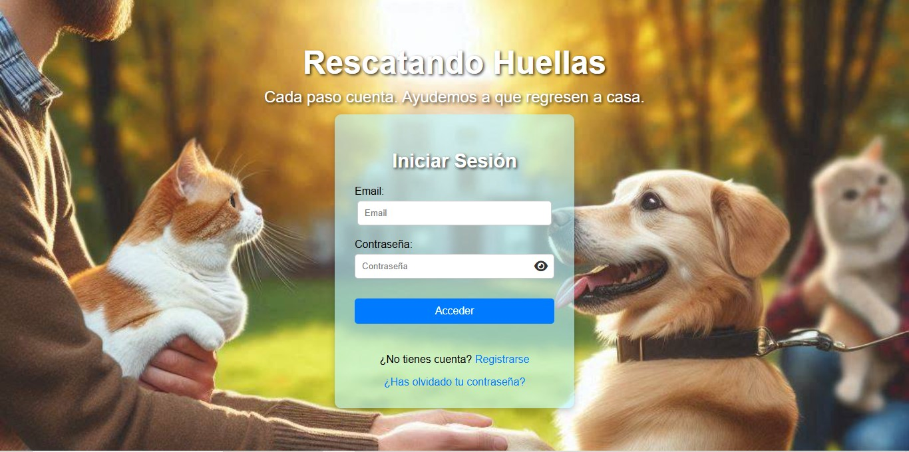
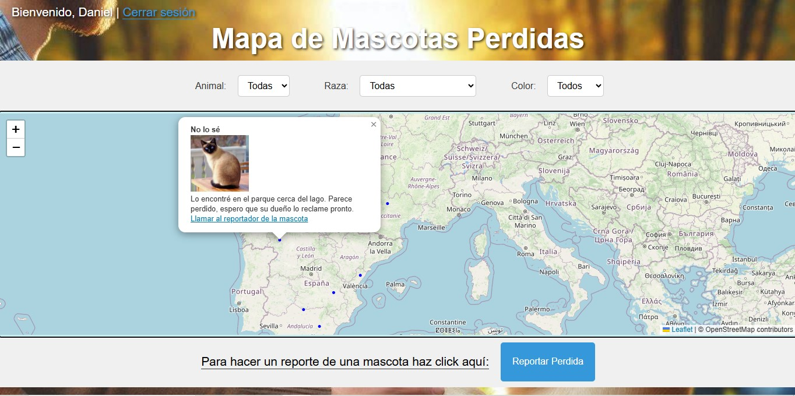
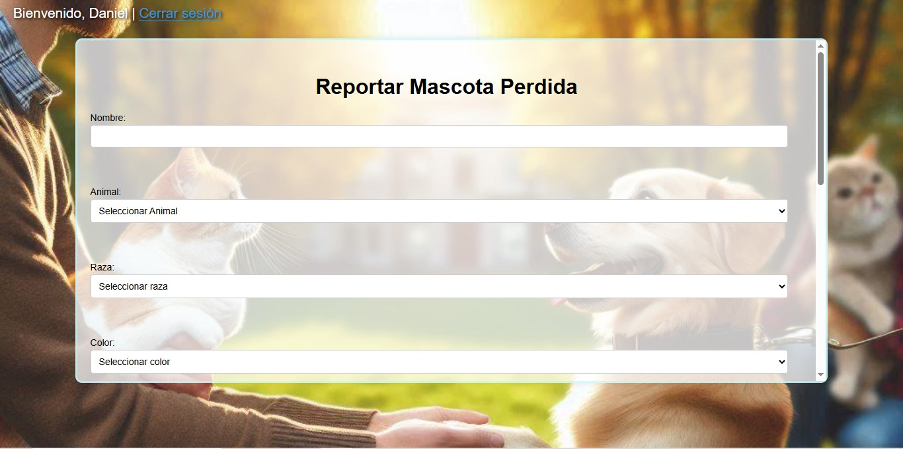

# Mascotas Perdidas - Plataforma para reportar y encontrar mascotas

Este proyecto es una plataforma web diseñada para ayudar a las personas a reportar mascotas perdidas y encontrar aquellas que han sido reportadas por otros usuarios. Incluye un mapa interactivo, filtros de búsqueda y un sistema de reportes.

---

## 🚀 Funcionalidades principales

- **Registro de usuarios**: Permite a los usuarios registrarse para acceder a la plataforma.
- **Inicio de sesión**: Los usuarios pueden iniciar sesión para acceder a las funcionalidades del sitio.
- **Mapa interactivo**: Muestra las ubicaciones de las mascotas reportadas.
- **Filtros de búsqueda**: Permite buscar mascotas por especie, raza y color.
- **Reportar mascotas**: Permite a los usuarios reportar mascotas encontradas, incluyendo detalles como nombre, raza, color, descripción, imagen y ubicación.
- **Contacto**: Los usuarios pueden contactar a quien reportó una mascota para recuperarla.
- **Cuenta regresiva**: Los reportes de mascotas tienen una cuenta regresiva de 5 minutos antes de caducar.

---

## 🛠️ Tecnologías utilizadas

- **Frontend**: HTML, CSS, JavaScript.
- **Backend**: PHP.
- **Base de datos**: MySQL.
- **Mapas**: [Leaflet](https://leafletjs.com/) para el mapa interactivo.
- **API de geolocalización**: Para obtener la ubicación del usuario.

---

## 📂 Estructura del proyecto

El proyecto consta de los siguientes archivos principales:

### **Carpeta `public`**
- **`css/styles.css`**: Estilos CSS para la interfaz de usuario.
- **`js/operativa_login.js`**: Lógica para manejar el inicio de sesión.
- **`js/operativa_mascotas.js`**: Lógica para manejar el mapa interactivo y los reportes de mascotas.
- **`js/operativa_recuperar.js`**: Lógica para manejar la recuperación de contraseña.
- **`js/operativa_registro.js`**: Lógica para manejar el registro de usuarios.

### **Carpeta `src/controllers`**
- **`actualizar_contrasena.php`**: Lógica para actualizar la contraseña del usuario.
- **`add_mascota.php`**: Lógica para agregar una mascota reportada.
- **`eliminar_mascota.php`**: Lógica para eliminar un reporte de mascota.
- **`get_mascotas.php`**: Lógica para obtener las mascotas reportadas.
- **`login.php`**: Lógica para manejar el inicio de sesión.
- **`logout.php`**: Lógica para cerrar la sesión del usuario.
- **`recuperar_contrasena.php`**: Lógica para manejar la recuperación de contraseña.
- **`registrar.php`**: Lógica para manejar el registro de usuarios.

### **Carpeta `src/views`**
- **`mapa.php`**: Página principal con el mapa interactivo y los filtros de búsqueda.
- **`recuperar_contrasena_form.php`**: Formulario para recuperar la contraseña.
- **`registro.php`**: Formulario de registro de usuarios.
- **`restablecer_contrasena.php`**: Formulario para restablecer la contraseña.
- **`token_expirado.php`**: Página que muestra un mensaje cuando el token de recuperación ha expirado.
- **`index.php`**: Página de inicio con el formulario de inicio de sesión.

---

## 🖼️ Capturas de pantalla

  
*Página principal con el formulario de inicio de sesión y registro.*

  
*Mapa interactivo con filtros de búsqueda y opción para reportar mascotas.*

  
*Formulario para reportar una mascota encontrada.*

---

## 🌐 Enlace al proyecto

Puedes probar la plataforma en el siguiente enlace: [www.mascotasperdidas.fwh.is](http://www.mascotasperdidas.fwh.is)

